# Setup 

[Home](./README.md) > Setup

# Summary

This guide will cover the setup and three virtual machines. The guide was written using VMWare Workstation Pro, but you can use any resources available to you. You may just have to improve some sections. There's no reason this should not work on most infrastructure. 

# Warning 

This is a lab, it uses weak passwords and tools for testing security. Only set this up where you have permission to operate. It is not recommended to set this up in your production environment. Take caution and use good judgment. #notlegaladvice. 

# Required Software 

You'll create three virtual machines as a part of this lab. The ISO for each can be found here. 

- [Ubuntu Server 20.04 ISO](https://ubuntu.com/download/server)
- [Windows Server 2022 Evaluation ISO](https://www.microsoft.com/en-us/evalcenter/evaluate-windows-server)
- [Windows 10 Enterprise Evaluation ISO](https://www.microsoft.com/en-us/evalcenter/evaluate-windows-10-enterprise)

# Environment Overview 

## Splunk Enterprise Server

Splunk Enterprise will be installed on an Ubuntu server, and the following modifications will be made. 
  - Sysmon index created.
  - Sysmon TA installed modified and made a deployment app. 
  - Sysmon TA modified to log to Sysmon index. 
  - Server Class is made. 
  - Sysmon App added to Server Class
  - Hostname filter added to Server Class

## Windows Machines 

A Windows Server will be spun up as a Domain Controller and Windows 10 client will be spun up. This is so that you can run domain tests as well. The following modifications will be made. 

Server 
   - Host will be renamed.
   - Install DC and DNS roles
   - Promoted to Domain Controller and a forest will be created 
   - New user `lab_admin` will be created. 

Windows 10 Client
   - Renamed
   - Joined to domain 
   - `lab_admin` will be added to the administrator group.

Software Installed on Client and Server 
   - Sysmon
   - [Swift On Security Configuration file](https://github.com/SwiftOnSecurity/sysmon-config)
   - Splunk Universal Forwarder
   - [Atomic Red Team](https://github.com/redcanaryco/atomic-red-team)

## Accounts 

**Splunk**
- `admin`:`P@ssword`
- `lab_admin`:`P@ssword`

# Setup Splunk Enterprise on Ubuntu Linux

## Creating a Virtual Machine in VMWare Workstation Pro 

This is the method that I used to set up all of my virtual machines. You do not have to use VMWare, but this is what I used. There are also free options like [Oracle Virtual Box](https://www.virtualbox.org/) or depending on your Windows SKU [Hyper-V](https://docs.microsoft.com/en-us/virtualization/hyper-v-on-windows/quick-start/enable-hyper-v) that work using similar concepts. You can also use cloud machines, but be sure to take precautions and lock them down. 

I followed this method to create the three virtual machines use in the lab. Each uses a different ISO, but similar options. 

1. Click File>**New Virtual Machine...**

   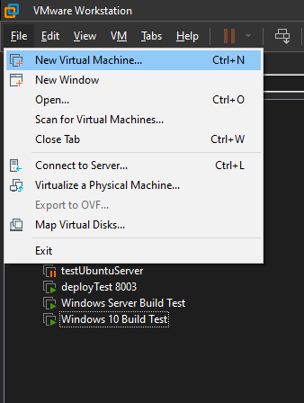

2. Select **typical** configuration and click **Next**. 
3. Select **I will install the operating system later**, and click **Next**. 

   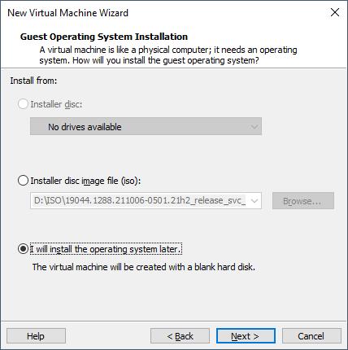

4. Select the **Guest Operating System** and **Version**, then click **Next**. I used the following for the various VMs. 
   |Description | Guest Operating System | Version |
   |---|---|---|
   |Splunk Enterprise Server|Linux| Ubuntu 64-bit|
   |Windows Domain Controller|Microsoft Windows|Windows Server 2019|
   |Windows 10 Client|Microsoft Windows|Windows 10 and later x64|
5. Name the Virtual Machine and set the installation location, then click **Next**. 
6. Set disk size. I would use a larger disk for the Splunk Enterprise Server, e.g, 80GB, but use whatever you are comfortable with. 
7. Choose how the files are stored. Default is fine. Click **Next**. 
8. Review the summary and click **Finish**. 

   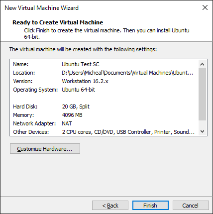

9. Once the VM has been created click the VM name in the left-hand navigation. 
10. Click **Edit virtual machine settings**. 
 
   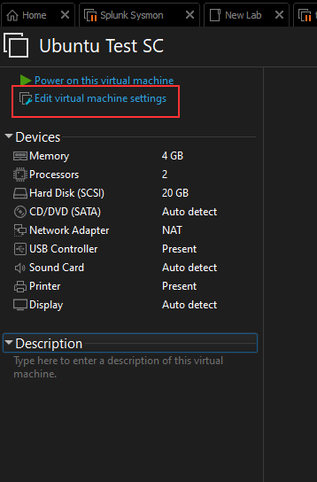

11. In the left-hand navigation click **CD/DVD** and set your ISO file. That you'll use for the installation, and click **OK**. 

   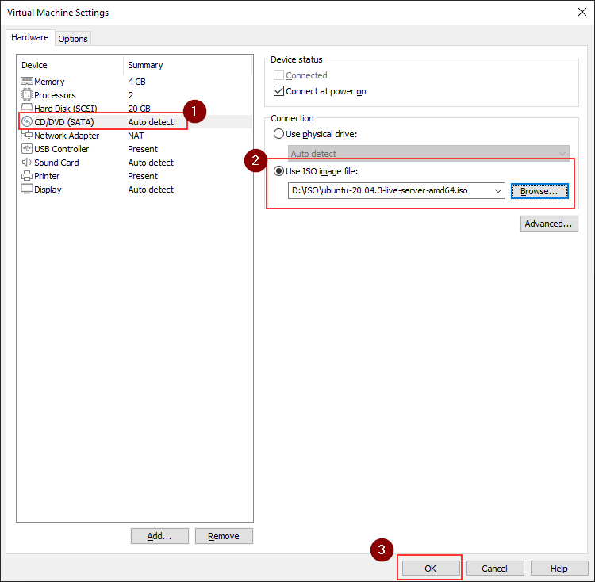

12.  Click **Power on this virtual machine**. 

   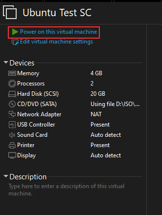

# Splunk Enterprise Setup 

## Linux Installation 
1. Create a Linux VM - [Ubuntu Server 20.04 ISO](https://ubuntu.com/download/server)
1. Once you've started the Linux VM, there will be some configurations options. Using all the defaults is fine. Set options as you need to, like username and password. And if something confuses you hit, next, or continue, and confirm any changes The installer wants to make.  
2. Once the installation has finished log in using the credentials you set during installation. 
5.  Run the command 
      -  `sudo apt update && sudo apt upgrade && sudo apt install openssh-server net-tools`

6.  It's not required, but I SSH'd into the Ubuntu VM from my host for a better experience after installing the SSH Server. 
    - `ssh admin@192.168.202.135 -p 22`   
7.  Clone the git repo to a directory of your choice. 
    - `git clone https://github.com/mrstephenson2142/splunkSysmonLab.git`
9.  Navigate to **setup_splunk_server** in the repo you downloaded. 
    - `cd splunkSysmonLab/setup_splunk_server`
10.  Make the setup script executable. 
     - `chmod +x linux_config1.sh`
12. Run the Splunk setup script and accept all prompts or press yes. 
    - `./linux_config1.sh`
13. The script will take a few minutes to run, and Splunk will restart a couple of times. 
14. When the script has finished you should see a message about completion and the best guess at your IP Address. Make note of your Splunk Server IP address.  
16. Open a web browser and navigate to your Splunk Server IP on port 8000, e.g, `http://192.168.202.135`, and log in with the credentials `admin`:`P@ssword`. 
17. If you are having issues, see the [section about potentially needing a NAT](#vmware-workstation-nat). No firewall rules should be blocking access as described. Any issues are likely due to network connectivity. 

# Setup Domain Controller/DNS Server on Windows 2022
1. Create a Windows Server VM - [Windows Server 2022 Evaluation ISO](https://www.microsoft.com/en-us/evalcenter/evaluate-windows-server)
2. Open an Administrative PowerShell and set your execution policy. 
3. `Set-ExecutionPolicy RemoteSigned`
4. Make a working directory in the root of C. 
   - `mkdir c:\tmp`
5. Download the repository. 
   - `Invoke-WebRequest https://github.com/mrstephenson2142/splunkSysmonLab/archive/refs/heads/main.zip -OutFile c:\tmp\splunkRepo.zip`
6. Unzip the repository files. 
   -  `Expand-Archive -LiteralPath c:\tmp\splunkRepo.zip -DestinationPath c:\tmp`
7. Navigate to **setup_dc** in side the expanded archive. 
   - `cd c:\tmp\splunkSysmonLab\setup_dc`
9. Run **dc_setup.ps1**. Two restarts will be required. After each restart navigate back to the script and run it again in an administrative PowerShell. The script will resume in the correct phase of the setup. 
   - `.\dc_setup.ps1`
10. Navigate to setup_tools in the repo. 
    - `cd c:\tmp\splunkSysmonLab\setup_dc`
11. Run the **install_tools.ps1** script. You will need the Splunk Server IP. Accept all prompts. 
       - `.\install_tools.ps1`
12. After you see the completion message you are done with the setup. 
13. Make a note of the IPv4 address of the domain controller. 

# Setup Windows 10 Client on Domain 

1. Create a Windows 10 x64 VM - [Windows 10 Enterprise Evaluation ISO](https://www.microsoft.com/en-us/evalcenter/evaluate-windows-10-enterprise)
2. Open an Administrative PowerShell and set your execution policy. 
3. `Set-ExecutionPolicy RemoteSigned`
4. Make a working directory in the root of C. 
   - `mkdir c:\tmp`
5. Download the repository. 
   - `Invoke-WebRequest https://github.com/mrstephenson2142/splunkSysmonLab/archive/refs/heads/main.zip -OutFile c:\tmp\splunkRepo.zip`
6. Unzip the repository files. 
   -  `Expand-Archive -LiteralPath c:\tmp\splunkRepo.zip -DestinationPath c:\tmp`
7. Navigate to **setup_win_client** in side the expanded archive. 
   - `cd c:\tmp\splunkSysmonLab\setup_win_client`
9. Run **setup_win_client.ps1**. One restart will be required at the end of the script. You will need the Domain Controller/DNS Server IP Address. 
   - `.\setup_win_client.ps1`
10. Login with your new domain account. `lab_admin`:`P@ssword`
11. Open an administrative PowerShell. 
10. Navigate to setup_tools in the repo. 
    - `cd c:\tmp\splunkSysmonLab\setup_dc`
11. Run the **install_tools.ps1** script. You will need the Splunk Server IP. Accept all prompts. 
       - `.\install_tools.ps1`
12. After you see the completion message the lab should be completely set up! 

**You've set up the lab! Move on to the [Testing Guide!](./Testing.md)**

# VMware Workstation NAT

If you are using VMWare Workstation Pro and want to access your clients or services they are running using their NAT network adapter from your host machine, you may need to set up a NAT to the port running the Service.

For example, if I want to access Splunk that is running on port 8000 on my VM from my host PC. I could use the NAT settings to map a port on my host PC to the port on my VM. They could be the same port, or you can make the HOST port anything you want. 

1. Click **Edit > Virtual Network Editor**.

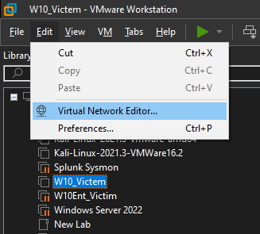

2. Click **Change Settings** and approve the UAC prompt. 

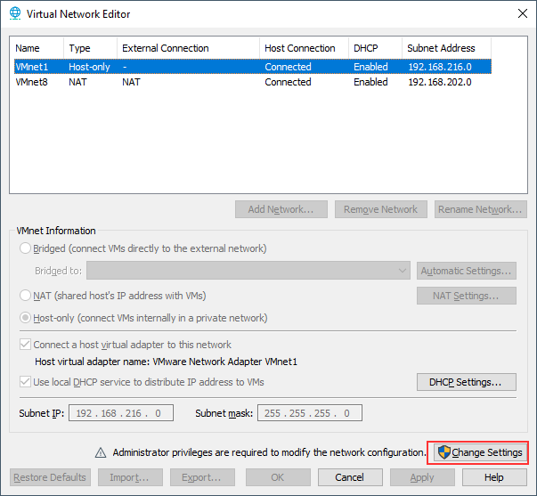

3. Click the NAT adapter. 
4. Click **NAT Settings**

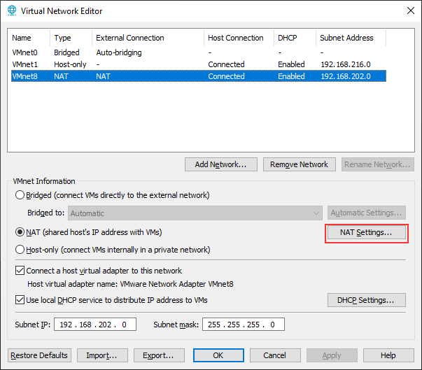

1. Click **Add**

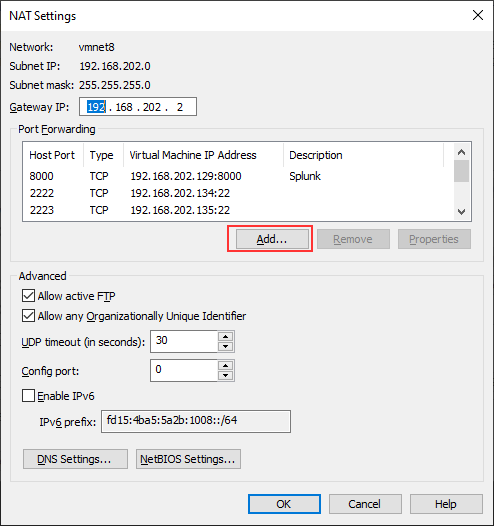

2. Set the Host port to the port you want to use on your host machine to access the client application. 
3. Set your protocol type. 
4. Set the Virtual Machine IP address. 
5.  Set the port that the Virtual Machine is using to host the application. 
6.  Set a description. 
7.  Click **OK** on all Dialog boxes, your adapters will reset, and you may lose connectivity briefly. 

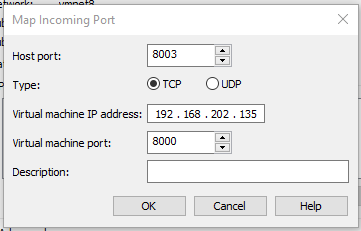

Now you should be able to access your VM's service on your local adapter using the Host NAT port 

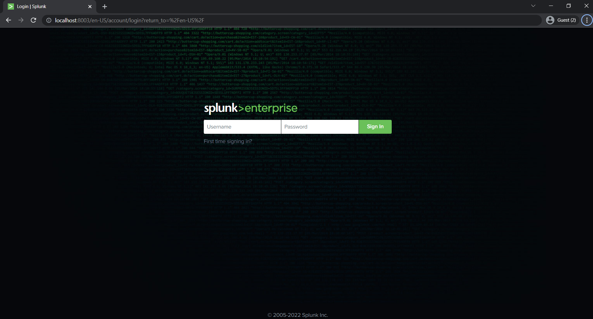

