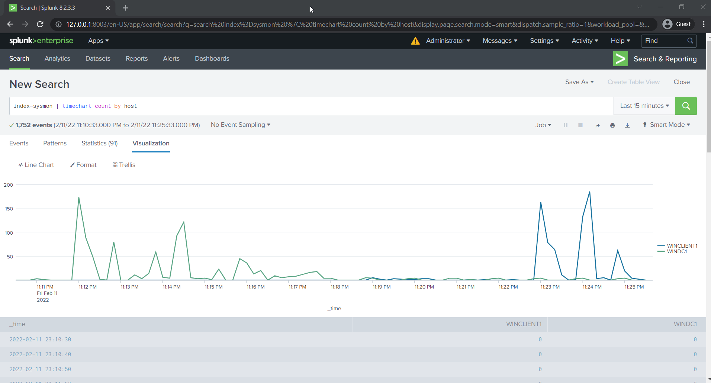

# Testing 

[Home](./README.md) > Testing

We'll use the [Invoke-Atomic](https://github.com/redcanaryco/invoke-atomicredteam) framework by Red Canary to see what the current Sysmon configuration ([SwiftOnSecurity/sysmon-config](https://github.com/SwiftOnSecurity/sysmon-config)) will find and log to Splunk. 

The attack description will describe and show you what will be performed. This will give you keywords that you can search for in Splunk so that you can see how the attacks are performed. This example will launch an attack that looks for passwords in registry files. [T1552.002](https://github.com/redcanaryco/atomic-red-team/blob/master/atomics/T1552.002/T1552.002.md)

All commands being used can be found in the [Invoke-Atomic wiki](https://github.com/redcanaryco/invoke-atomicredteam/wiki/List-Atomic-Tests).

# Logging into Splunk

1. Open a web browser and navigate to `http://127.0.0.1:8000`. 
   1. If you had to create a NAT and did not use `8000`, use the other port instead. 
   

2. Log into Splunk using the credentials `admin`:`P@ssword`
3. Click **Search & Reporting** in the left-hand navigation. 

4. Enter the query `index=sysmon | timechart count by host` in the search bar and press enter. 
5. You can adjust the time to fit your graph. The last 15 minutes or last 4 hours is usually fine. 
6. Click on the **Visualization** tab and set the chart type to **Line Chart**. Running the tools scripts could take 10 minutes or more before you see logs. 

# Test an attack on the DC 

## View Test description and Invoke the Test

1. Log in to the domain controller.
2. Open an administrative PowerShell. 
3. See a brief description of all tests listed.  
   - `Invoke-AtomicTest T1552.002 -ShowDetailsBrief`
4. We'll use test 1 in this example. Look at the full details to see a description and what the attack looks for. 
   - `Invoke-AtomicTest T1552.002 -ShowDetails -TestNumbers 1`
5. We can see that these two commands are being run. 
   - `reg query HKLM /f password /t REG_SZ /s`
   - `reg query HKCU /f password /t REG_SZ /s`
  
   

6. Check if the attack requires any prerequisites. 
   - `Invoke-AtomicTest T1552.002 -TestNumbers 1 -CheckPrereqs`
7. If the prereqs are not met. Attempt to install them automatically. 
   - `Invoke-AtomicTest T1552.002 -TestNumbers 1 -getPrereqs`
8. Invoke the test. 
   - `Invoke-AtomicTest T1552.002 -TestNumbers 1`
  
   
9.  The test will run then results will show. 
10. Clean up after your test is complete. 
   - `Invoke-AtomicTest T1552.002 -TestNumbers 1 -cleanup`

**Running**

**Results** 

                                                                                                                        
## Check Splunk for logging vs Test 

1. [Login to your Splunk instance](#logging-in-to-splunk).
2. In the **Search & Reporting** app, run a search in the **sysmon** index looking for clues from the strings we know the test performed. 
   - `index=sysmon *password*`
3. Right away we can see events related to the Atomic Test. 

4. If you expand the event you can see what fields were extracted and who additional information you may be able to use to pivot. 

## Repeat the exercise! 

That's it! You now have an entire lab at your disposal to look at the tests, all of which are mapped to MITRE ATT&CK, perform the tests, see what you can find in Splunk, and more. You can see what Sysmon logs. If you're feeling brave you should make modifications to the Sysmon configuration file and see what else you can find there are a lot of great resources out there. You can expand your Splunk knowledge and add more logging into Splunk from your clients or test other tools against your device. 
